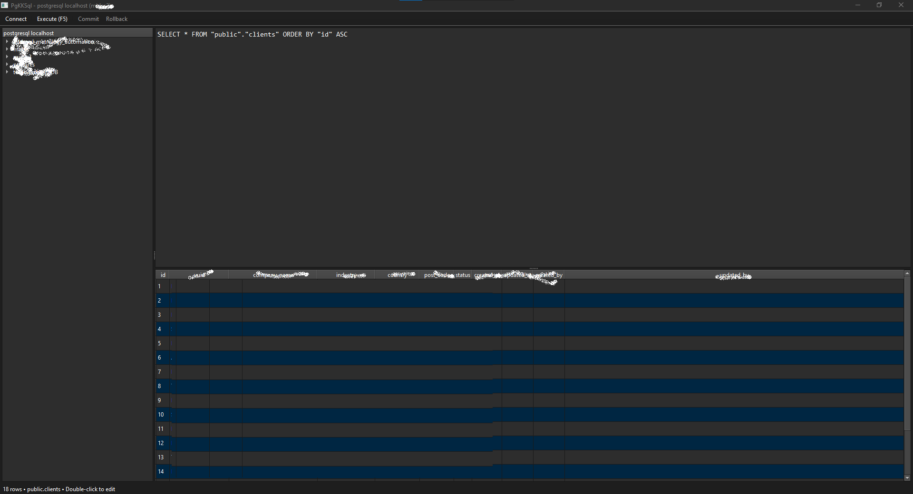

# PgKKSql

A minimal, lightning-fast PostgreSQL GUI client built with Python and PySide6 (Qt).

**Designed to be a 10× faster alternative to pgAdmin.**



## Features

### 🚀 Core Features
- **Saved Connections** - Store multiple database connections with auto-connect to last used
- **Multi-Database Support** - Browse all databases on a server, switch seamlessly
- **Schema Browser** - Lazy-loaded tree: Databases → Schemas → Tables
- **SQL Editor** - Monospace editor with syntax autocomplete
- **Query Execution** - Run any SQL with F5 or Ctrl+Enter
- **Results Grid** - Fast QTableView with alternating row colors

### ✏️ Inline Editing
- **Double-click to edit** any cell in query results
- **Type-aware editors**:
  - Boolean → Dropdown (True/False/NULL)
  - Integer → Spin box
  - Float → Double spin box
  - Text → Line edit
- **Visual feedback** - Edited cells highlighted in orange
- **Transaction control** - Manual Commit/Rollback buttons
- **Smart detection** - Parses custom SELECT queries to enable editing

### 🧠 SQL Autocomplete
- Table names from current database
- Column names across all tables
- SQL keywords (SELECT, FROM, WHERE, JOIN, etc.)
- Schema-qualified names (`public.users`)
- Press **Tab** or **Enter** to accept suggestions

### ⚡ Performance
- Server-side cursors for large result sets
- Lazy metadata loading (schemas/tables load on expand)
- Async query execution (QThread - UI never freezes)
- Auto `LIMIT 1000` for SELECT queries without LIMIT
- No background polling - minimal resource usage

### 🛡️ Error Handling
- SQL errors displayed in dedicated message area (not just status bar)
- Color-coded feedback:
  - 🔴 Red background for errors
  - 🟢 Green background for successful DML
- Never crashes on bad queries

## Installation

### Requirements
- Python 3.10+
- PostgreSQL server

### Install Dependencies

```bash
pip install psycopg[binary] PySide6
```

### Run

```bash
python main.py
```

## Usage

### Connecting
1. On first launch, the connection dialog appears
2. Fill in: Name, Host, Port, Database, User, Password
3. Click **Save** to store the connection
4. Click **Connect**

Subsequent launches auto-connect to your last used connection.

### Browsing
- Expand databases in the left sidebar
- Expand schemas to see tables
- **Double-click a table** to run `SELECT * FROM table ORDER BY pk ASC`

### Querying
1. Type SQL in the editor (autocomplete helps!)
2. Press **F5** or **Ctrl+Enter** to execute
3. Results appear in the grid below

### Editing Data
1. Run a SELECT on a single table
2. Double-click any cell to edit
3. Modified cells turn orange
4. Click **Commit** to save or **Rollback** to discard

> **Note:** Editing requires a primary key. JOINs and complex queries are read-only.

## File Structure

```
PgKKSql/
├── main.py           # Entry point
├── db.py             # Database operations (psycopg3)
├── ui.py             # All UI components (PySide6)
├── connections.json  # Saved connections (auto-created)
└── requirements.txt  # Dependencies
```

## Keyboard Shortcuts

| Shortcut | Action |
|----------|--------|
| `F5` | Execute query |
| `Ctrl+Enter` | Execute query |
| `Tab` | Accept autocomplete suggestion |
| `Escape` | Dismiss autocomplete |
| `Double-click` | Edit cell / Open table |

## Technical Details

- **GUI Framework:** PySide6 (Qt 6)
- **Database Driver:** psycopg3 (modern async PostgreSQL adapter)
- **Architecture:** Raw SQL only, no ORM
- **Connections:** Stored in JSON with `last_connected_at` timestamp

## What This Is NOT

- ❌ No migrations
- ❌ No query history
- ❌ No ER diagrams
- ❌ No extensions/plugins
- ❌ No Electron bloat

## License

MIT License - Use freely, modify as needed.

---

**Built for developers who want a fast, simple PostgreSQL client without the overhead.**

